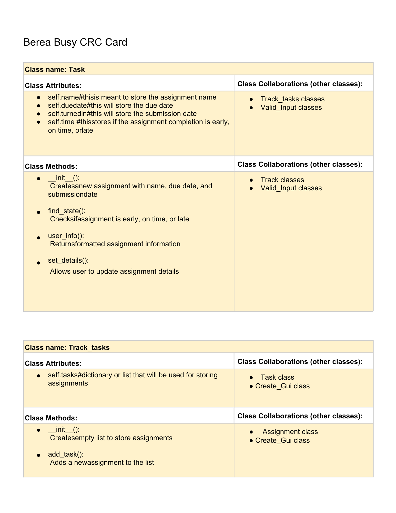
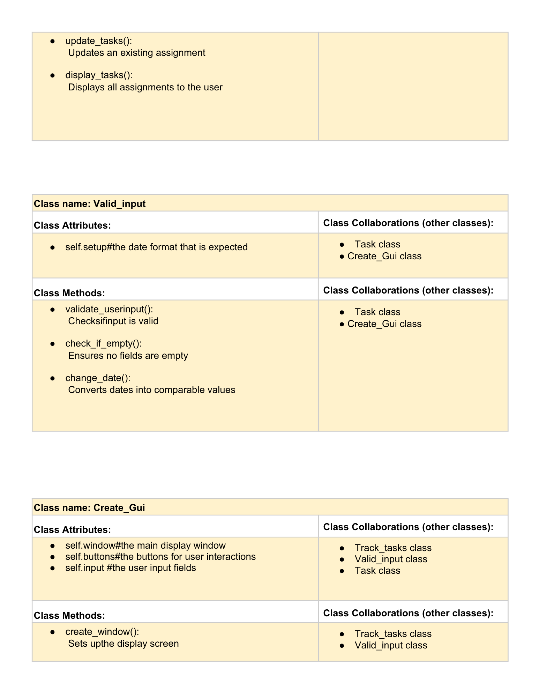
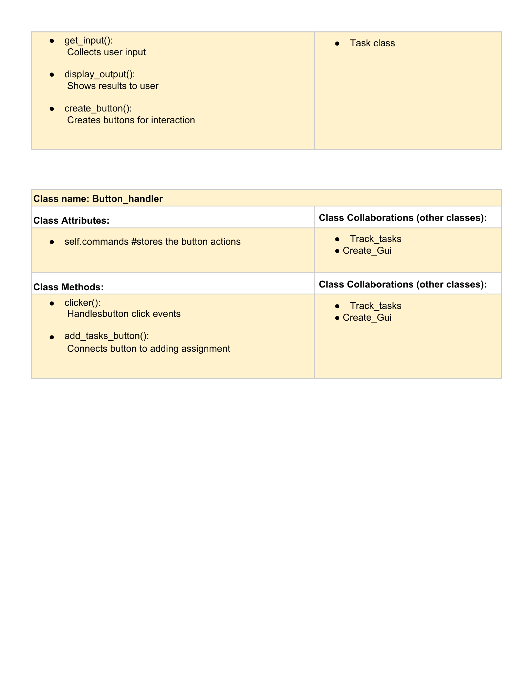

# CSC226 Final Project

## Instructions

❗️Exclamation Marks ❗️indicate action items; you should remove these emoji as you complete/update the items which 
  they accompany. (This means that your final README should have no ❗️in it!)

**Author(s)**: Briana Nshimirimana, Alicia Bacani, Mildred Catalina Gonzalez Molina

**Google Doc Link**: https://docs.google.com/document/d/11g5x7LPXIePmf0ZSQTababjXhH9a_7n19E9Ui3MhEjg/edit?usp=sharing

---

## Milestone 1: Setup, Planning, Design

**Title**: `Berea Busy`

**Purpose**: This program is meant to take in users tasks and due dates and keep track of progress made. When task completed
at certain times (e.g.on time or early) user will receive a token of sort to celebrate the completion.

️**Source Assignment(s)**: `T08: Deep vs. Shallow Copy, Pygame (Taco cat & Tuna), Events & GUIs `

**CRC Card(s)**:
  - Create a CRC card for each class that your project will implement.
  - See this link for a sample CRC card and a template to use for your own cards (you will have to make a copy to edit):
    [CRC Card Example](https://docs.google.com/document/d/1JE_3Qmytk_JGztRqkPXWACJwciPH61VCx3idIlBCVFY/edit?usp=sharing)
  - Tables in markdown are not easy, so we suggest saving your CRC card as an image and including the image(s) in the 
    README. You can do this by saving an image in the repository and linking to it. See the sample CRC card below - 
    and REPLACE it with your own:
  






️**Branches**: This project will **require** effective use of git. 

Each partner should create a branch at the beginning of the project, and stay on this branch (or branches of their 
branch) as they work. When you need to bring each others branches together, do so by merging each other's branches 
into your own, following the process we've discussed in previous assignments, then re-branching out from the merged code.  

```
    Branch 1 starting name: nshimirimanao-bacania-gonzalezmolinam  ---> Bri's Branch
    Branch 2 starting name: bacania_part2-P01
    Branch 3 starting name: gonzalezmolinam-nb-ab    ----> Catalina's branch
```

### References 

❗Throughout this project, you will likely use outside resources. Reference all ideas which are not your own, 
and describe how you integrated the ideas or code into your program. This includes online sources, people who have 
helped you, AI tools you've used, and any other resources that are not solely your own contribution. Update this 
section as you go. DO NOT forget about it! 

- import re is being used for formatting the time, duedate, and the name of assignment (taken from 
- google ai frontpage: https://stackoverflow.com/questions/54700710/how-to-get-the-countdown-date-to-display-correctly-using-python-3)

- import time was something we were already aware of in terms of sleep, but now we have also referenced this to 
- ensure due dates are set and met. (also from google ai front page:https://stackoverflow.com/questions/54700710/how-to-get-the-countdown-date-to-display-correctly-using-python-3 )

- tkinter ONLY centering code was from a website: https://www.geeksforgeeks.org/python/python-gui-tkinter/
- from datetime import datetime, timedelta (taken from google ai front page: https://realpython.com/python-datetime/)

- #found reference code from python guide https://pythonguides.com/tkinter-frame-background-color/

-
---

## Milestone 2: Code Setup and Issue Queue

Most importantly, keep your issue queue up to date, and focus on your code. 🙃

Reflect on what you’ve done so far. How’s it going? Are you feeling behind/ahead? What are you worried about? 
What has surprised you so far? Describe your general feelings. Be honest with yourself; this section is for you, not me.

```
    The project idea was is going well but implementation is where we run into issues. Just trying to stay focused and 
    ground feasible tasks and not getting distracted by ideas we get along the way. We feel somewhat on track, we just need
    to work to blending each other's code together for a more uniformed and working code.
```

---

## Milestone 3: Virtual Check-In

Indicate what percentage of the project you have left to complete and how confident you feel. 

**Completion Percentage**: `40-45`

️**Confidence**: Describe how confident you feel about completing this project, and why. Then, describe some 
  strategies you can employ to increase the likelihood that you'll be successful in completing this project 
  before the deadline.

```
    The reason we scored low was because we had issues with git but after resolving the issues we feel confident to 
    get at least or main idea ready for presentation by Sunday. We have each others code we worked on separately and combined
    it. Now we are changing things within for everything to run cohesively and tweak parts we may need to remove or expand on.
```

---

## Milestone 4: Final Code, Presentation, Demo

### ❗User Instructions

❗In a paragraph, explain how to use your program. Assume the user is starting just after they hit the "Run" button 
in PyCharm. 

### ❗Errors and Constraints

❗Every program has bugs or features that had to be scrapped for time. These bugs should be tracked in the issue queue. 
You should already have a few items in here from the prior weeks. Create a new issue for any undocumented errors and 
deficiencies that remain in your code. Bugs found that aren't acknowledged in the queue will be penalized.

### ❗Reflection

❗Each partner should write three to four well-written paragraphs address the following (at a minimum):
- Why did you select the project that you did?
- How closely did your final project reflect your initial design?
- What did you learn from this process?
- What was the hardest part of the final project?
- What would you do differently next time, knowing what you know now?
- How well did you work with your partner? What made it go well? What made it challenging?

```
    Partner 1: **Replace this with your reflection
```

```
    Partner 2: **Replace this with your reflection
```

```
    Partner 2: I selected this project because I wanted to create something useful for college or business settings, specifically, a tool that could help people manage their time in their daily lives while also encouraging them to stay motivated and keep working hard. 
    Our final project reflected our initial design very closely; we combined everyone’s ideas, and they fit together well, so the final product matched what we originally planned. As a well‑organized team, we were able to implement most of the features from our initial design.
    Through this process, I learned how important it is to focus on design from the beginning: setting goals, dividing tasks, and creating a clear plan to follow. I also learned how essential it is to handle challenges without giving up when the code breaks unexpectedly, and instead analyze the problem and find a solution. 
    Teamwork, communication, and reliability were also key—knowing each member’s strengths, asking for help when needed, working independently, and discussing changes helped prevent errors and encouraged brainstorming. I also learned to understand every bug and its solution so I can fix similar issues in the future. 
    The hardest part of the final project was the technical challenges we faced, but thanks to help from our professor and our peer Nick, we were able to solve our branch problem. If I could do something differently next time, I would set aside more time to add additional features; because it was finals week, we didn’t have as much time as we wanted to develop more tools for our users. 
    I worked well with both of my partners—I listened to them, completed my tasks responsibly and on time, and explained my changes. Our collaboration went smoothly, and we finished our product on schedule, even during a difficult week. The main challenge was simply the limited time we had to complete the project.
```

---