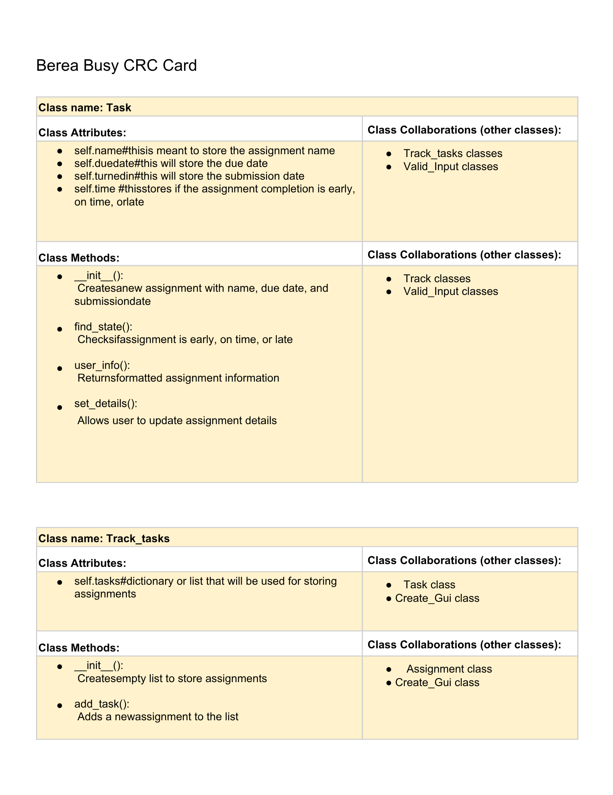
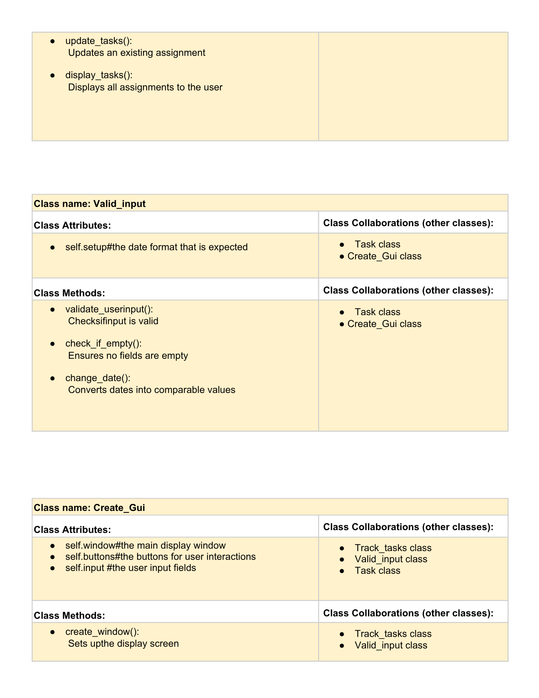
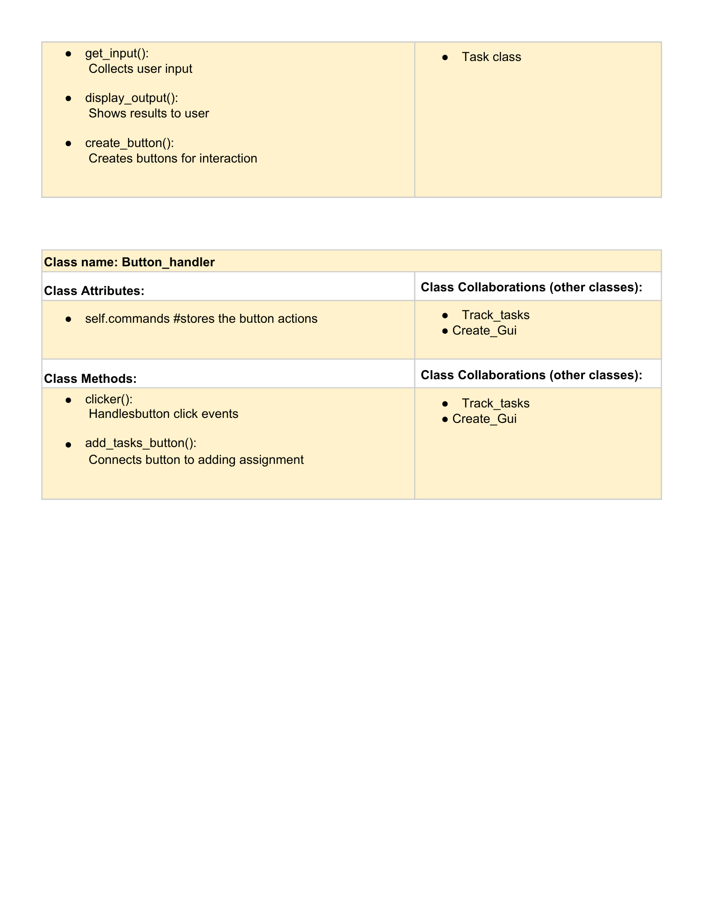

# CSC226 Final Project

## Instructions

**Author(s)**: Briana Nshimirimana, Alicia Bacani, Mildred Catalina Gonzalez Molina

**Google Doc Link**: https://docs.google.com/document/d/11g5x7LPXIePmf0ZSQTababjXhH9a_7n19E9Ui3MhEjg/edit?usp=sharing

---

## Milestone 1: Setup, Planning, Design

**Title**: `Berea Busy`

**Purpose**: This program is meant to take in users tasks and due dates and keep track of progress made. When task completed
at certain times (e.g.on time or early) user will receive a token of sort to celebrate the completion.

️**Source Assignment(s)**: `T08: Deep vs. Shallow Copy, Pygame (Taco cat & Tuna), Events & GUIs `

**CRC Card(s)**:






️**Branches**: This project will **require** effective use of git. 

Each partner should create a branch at the beginning of the project, and stay on this branch (or branches of their 
branch) as they work. When you need to bring each others branches together, do so by merging each other's branches 
into your own, following the process we've discussed in previous assignments, then re-branching out from the merged code.  

```
    Branch 1 starting name: nshimirimanao-bacania-gonzalezmolinam  ---> Bri's Branch
    Branch 2 starting name: bacania_part2-P01
    Branch 3 starting name: gonzalezmolinam-nb-ab    ----> Catalina's branch
```

### References 

Throughout this project, you will likely use outside resources. Reference all ideas which are not your own, 
and describe how you integrated the ideas or code into your program. This includes online sources, people who have 
helped you, AI tools you've used, and any other resources that are not solely your own contribution. Update this 
section as you go. DO NOT forget about it! 

- import re is being used for formatting the time, duedate, and the name of assignment (taken from 
- google ai frontpage: https://stackoverflow.com/questions/54700710/how-to-get-the-countdown-date-to-display-correctly-using-python-3)

- import time was something we were already aware of in terms of sleep, but now we have also referenced this to 
- ensure due dates are set and met. (also from google ai front page:https://stackoverflow.com/questions/54700710/how-to-get-the-countdown-date-to-display-correctly-using-python-3 )

- tkinter ONLY centering code was from a website: https://www.geeksforgeeks.org/python/python-gui-tkinter/
- from datetime import datetime, timedelta (taken from google ai front page: https://realpython.com/python-datetime/)

- #found reference code from python guide https://pythonguides.com/tkinter-frame-background-color/
- #found reference code from Stack Overflow to solve the frame size issue: https://stackoverflow.com/questions/55241150/tkinter-wraplength-units-is-pixels

- asked ChatGPT to help with scrollbar and check & uncheck. (only referenced and used what I needed)

-
---

## Milestone 2: Code Setup and Issue Queue 

Most importantly, keep your issue queue up to date, and focus on your code. 🙃

Reflect on what you’ve done so far. How’s it going? Are you feeling behind/ahead? What are you worried about? 
What has surprised you so far? Describe your general feelings. Be honest with yourself; this section is for you, not me.

```
    The project idea was is going well but implementation is where we run into issues. Just trying to stay focused and 
    ground feasible tasks and not getting distracted by ideas we get along the way. We feel somewhat on track, we just need
    to work to blending each other's code together for a more uniformed and working code.
```

---

## Milestone 3: Virtual Check-In

Indicate what percentage of the project you have left to complete and how confident you feel. 

**Completion Percentage**: `40-45`

️**Confidence**: Describe how confident you feel about completing this project, and why. Then, describe some 
  strategies you can employ to increase the likelihood that you'll be successful in completing this project 
  before the deadline.   

```
    The reason we scored low was because we had issues with git but after resolving the issues we feel confident to 
    get at least or main idea ready for presentation by Sunday. We have each others code we worked on separately and combined
    it. Now we are changing things within for everything to run cohesively and tweak parts we may need to remove or expand on.
```

---

## Milestone 4: Final Code, Presentation, Demo

### User Instructions

User hits run. User inputs the name of assignment NOT EXCEEDING THE 100 CHAR LIMIT. User inputs the date and time of the 
assignment due IN MILITARY TIME. User clicks add task Once task is completed, user checkmarks if user accidentally checks
an assignment, it is possible to uncheck and points will go back to original program.

### Errors and Constraints

issue queue is updated

### Reflection

Each partner should write three to four well-written paragraphs address the following (at a minimum):
- Why did you select the project that you did?
- How closely did your final project reflect your initial design?
- What did you learn from this process?
- What was the hardest part of the final project?
- What would you do differently next time, knowing what you know now?
- How well did you work with your partner? What made it go well? What made it challenging?

```
    Alicia: I liked this project lots! I feel like it taught me more about GUIs as I though that python was strictly a 
    backend language. I also learned more about how errors can help user experiences. We all collectively chose this 
    idea because we wanted to have a site that can still be utilized beyond this class alone. As for comparing this
    design to the original, it definitely is not the same. This because we didn't take into account connecting different 
    classes, and different libraries that can fix the issue more efficiently. The hardest part of the final process was 
    having all of our files complied into one. This is because we all had & referred to everything differently so the 
    syntax was a hassle. Next time I would communicate all of the class names, attributes, and delegate specfic times to 
    meet to ensure that we are working in person. That way, we would not have to work remotely and can communicate any 
    questions directlty. Our partners were fine, it was challenging at some points but nothing we couldn't get through. 
    Overall fun experience, 10/10 would def recommend. 
```

```
    Bri: We chose this assignment because we wanted a program that was one relatable and two can be expanded beyond
    this course. I would say if we were to compare or final project to our initial design it differs in some ways. I would say
    our initial design divided things that should've been together and also our final project had additions we decided to 
    make along the way to best support our overall idea and make it more engaging. 
    
    The top three things I learned from this process was the application of GUI's, Class relationships, and new library 
    usage that I haven't used previously (re). While I learned a lot I did still face challenges. The hardest part of 
    the final project for me was connecting all of our files into one single file that worked with no issue. There were
    a lot of bugs because of slight changes in name of methods, classes, or other aspects.
    
    If I were to do this again a few things I would do differently, is work with each other in person more so in the 
    beginning that way we can have a clearer idea of names we will use in our codes so it works correctly. I would also
    make comments outside of git and in our chosen communication so everyone is up to date with the changes in the 
    branches. I would also do a check in to see how we are feeling about our team's dynamic and our project that way any 
    issues that arise can be addressed.
    
    We were able to sucessfully complete a project that could be demoed in class. I will be honest while we did complete
    our tasks there were some points where it was a bit difficult. I would say communication played a part in that but we
    did over come our challenges and were able to push out a nice little tracker program. There were even times
    I would revert to things I learned in teamworking like a driver, navigator, and quality control if a section needed
    all three of us to work on it. Also, the freedom to as for help when needed or even offer up possible ideas for debugging
    was nice. Overall this experience was enriching.
```

```
    Catalina: I selected this project because I wanted to create something useful for college or business settings, 
    specifically, a tool that could help people manage their time in their daily lives while also encouraging them to 
    stay motivated and keep working hard. Our final project reflected our initial design very closely; we combined 
    everyone’s ideas, and they fit together well, so the final product matched what we originally planned. As a well‑
    organized team, we were able to implement most of the features from our initial design. Through this process, I 
    learned how important it is to focus on design from the beginning: setting goals, dividing tasks, and creating a 
    clear plan to follow. I also learned how essential it is to handle challenges without giving up when the code breaks
    unexpectedly, and instead analyze the problem and find a solution. Teamwork, communication, and reliability were 
    also key—knowing each member’s strengths, asking for help when needed, working independently, and discussing changes
    helped prevent errors and encouraged brainstorming. I also learned to understand every bug and its solution so I can
    fix similar issues in the future. The hardest part of the final project was the technical challenges we faced, but 
    thanks to help from our professor and our peer Nick, we were able to solve our branch problem. If I could do 
    something differently next time, I would set aside more time to add additional features; because it was finals week,
    we didn’t have as much time as we wanted to develop more tools for our users. I worked well with both of my partners
    —I listened to them, completed my tasks responsibly and on time, and explained my changes. Our collaboration went 
    smoothly, and we finished our product on schedule, even during a difficult week. The main challenge was simply the 
    limited time we had to complete the project.
```

---